Lesson 3
========================================================


***

### Pseudo-Facebook User Data


```r
pf <- read.csv('pseudo_facebook.tsv', sep='\t')
names(pf)
```

```
##  [1] "userid"                "age"                  
##  [3] "dob_day"               "dob_year"             
##  [5] "dob_month"             "gender"               
##  [7] "tenure"                "friend_count"         
##  [9] "friendships_initiated" "likes"                
## [11] "likes_received"        "mobile_likes"         
## [13] "mobile_likes_received" "www_likes"            
## [15] "www_likes_received"
```

***

### Histogram of Users' Birthdays


```r
library(ggplot2)
qplot(x= dob_day, data = pf) +
  scale_x_continuous(breaks=1:31)
```


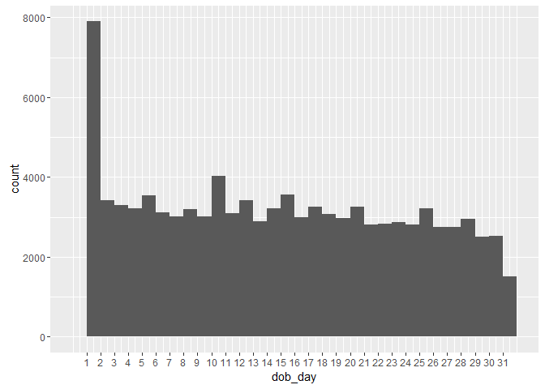

***

### Faceting

```r
qplot(x= dob_day, data = pf) +
  scale_x_continuous(breaks=1:31) +
  facet_wrap(~dob_month, ncol=3)
```

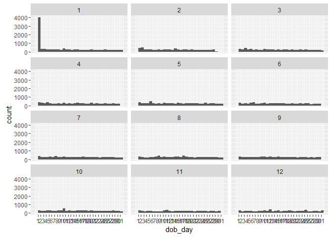


#### What code would you enter to create a histogram of friend counts?

```r
qplot(x = friend_count, data = pf)
```

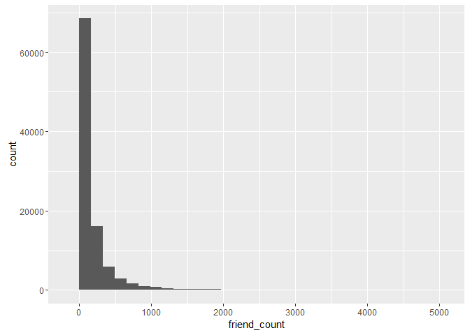


### Limiting the Axes

```r
#qplot(x = friend_count, data = pf, xlim = c(0, 1000) )
# or
qplot(x = friend_count, data = pf) +
  scale_x_continuous( limits = c(0,1000))
```

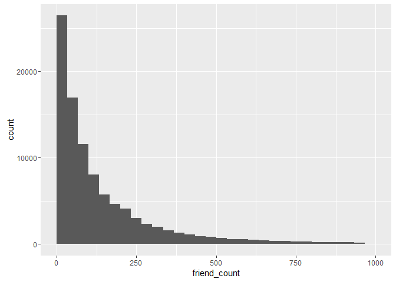


### Faceting Friend Count

```r
# What code would you add to create a facet the histogram by gender?

qplot(x = friend_count, data = pf, binwidth = 25) +
  scale_x_continuous(limits = c(0, 1000),
                     breaks = seq(0, 1000, 50)) +    # update the x-axis label
  facet_wrap(~gender)   
```

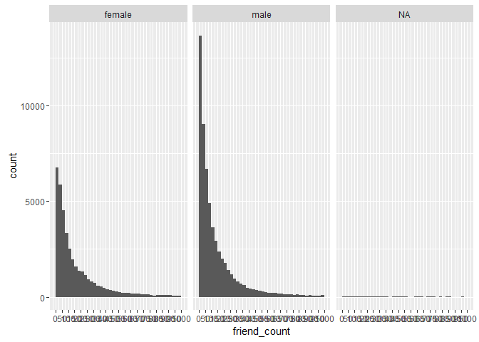

***

### Omitting NA Values

```r
#qplot(x = friend_count, data = na.omit(pf), binwidth = 25) +
#  scale_x_continuous(limits = c(0, 1000),
#                     breaks = seq(0, 1000, 50)) +    # update the x-axis label
#  facet_wrap(~gender)

# or

qplot(x = friend_count, data = subset(pf, !is.na(gender)), binwidth = 25) +
  scale_x_continuous(limits = c(0, 1000),
                     breaks = seq(0, 1000, 50)) +    # update the x-axis label
  facet_wrap(~gender)
```

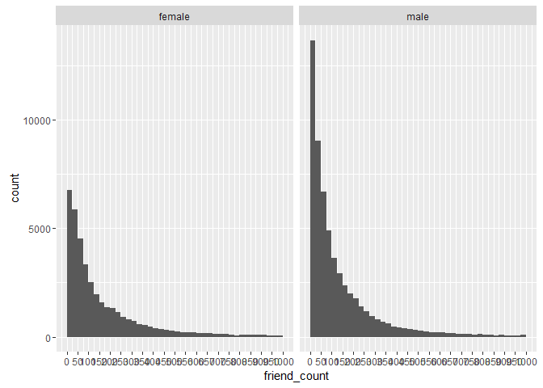

***

### Statistics 'by' Gender

```r
table(pf$gender)   # returns the number of female and male
```

```
## 
## female   male 
##  40254  58574
```

```r
by(pf$friend_count, pf$gender, summary)
```

```
## pf$gender: female
##    Min. 1st Qu.  Median    Mean 3rd Qu.    Max. 
##       0      37      96     242     244    4923 
## -------------------------------------------------------- 
## pf$gender: male
##    Min. 1st Qu.  Median    Mean 3rd Qu.    Max. 
##       0      27      74     165     182    4917
```

#### Why would the median be a better measure than the mean?
Response: more robust statistics

***

### Tenure

```r
qplot(x = tenure, data = pf, color = I('black'), fill= I('#099DD9') )
```

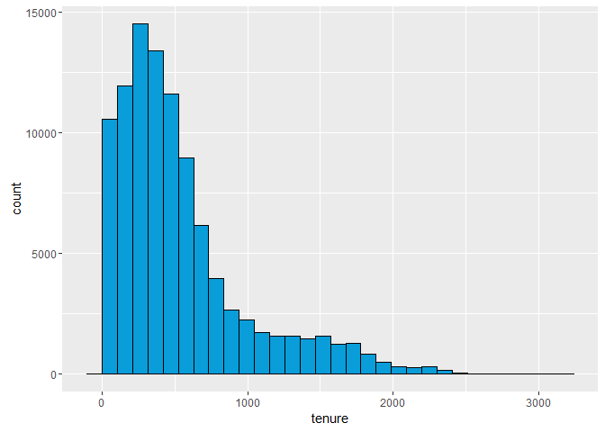

***

#### How would you create a histogram of tenure by year?

```r
qplot(x = tenure/365, data = pf, 
      color = I('black'), fill= I('#099DD9') , 
      binwidth = 0.25 ) +
  scale_x_continuous(limits = c(0, 7),
                     breaks = seq(0, 7, 1))
```

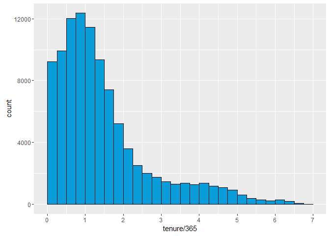

***

### Labeling Plots
Notes:


```r
qplot(x = tenure/365, data = pf, 
      xlab = 'Number of years using Facbook',
      ylab = 'Number of users in sample',
      color = I('black'), fill= I('#099DD9') , 
      binwidth = 0.25 ) +
  scale_x_continuous(limits = c(0, 7),
                     breaks = seq(0, 7, 1))
```

```
## Warning: Removed 26 rows containing non-finite values (stat_bin).
```

```
## Warning: Removed 2 rows containing missing values (geom_bar).
```

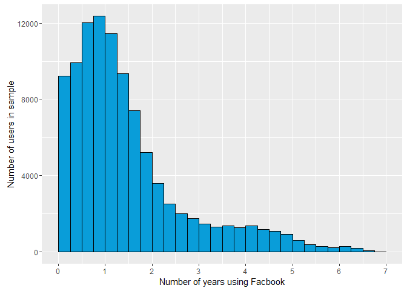

***

### User Ages
Notes:


```r
qplot(x = age, data = pf, 
      xlab = 'Age of Users',
      ylab = 'Number of users in sample',
      color = I('black'), fill= I('#099DD9') , 
      binwidth = 1 ) +
  scale_x_continuous(limits = c(10, 115),
                     breaks = seq(10, 115, 10)) 
```

```
## Warning: Removed 2 rows containing missing values (geom_bar).
```

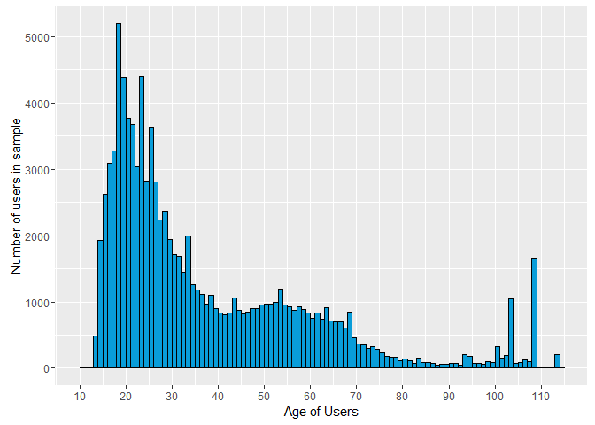

#### What do you notice?
Response:

***

### The Spread of Memes
Notes:

***

### Lada's Money Bag Meme
Notes:

***

### Transforming Data
Notes:


```r
summary( pf$friend_count   )
```

```
##    Min. 1st Qu.  Median    Mean 3rd Qu.    Max. 
##     0.0    31.0    82.0   196.4   206.0  4923.0
```

```r
summary( log10( pf$friend_count + 1)   )  #  + 1 to avoid to deal with - infinity
```

```
##    Min. 1st Qu.  Median    Mean 3rd Qu.    Max. 
##   0.000   1.505   1.919   1.868   2.316   3.692
```

```r
summary( sqrt( pf$friend_count + 1)   )
```

```
##    Min. 1st Qu.  Median    Mean 3rd Qu.    Max. 
##   1.000   5.657   9.110  11.180  14.390  70.170
```


***

### Add a Scaling Layer
Notes:


```r
#install.packages('gridExtra') 
library(gridExtra) 

# define individual plots
p1 <- qplot(x = friend_count, data = pf)
p2 <- qplot(x = friend_count, data = pf) +          # log10(friend_count+1)
  scale_x_log10()
p3 <- qplot(x = friend_count, data = pf) +          # sqrt(friend_count)
  scale_x_sqrt()
# arrange plots in grid
grid.arrange(p1, p2, p3, ncol=1)
```

```
## `stat_bin()` using `bins = 30`. Pick better value with `binwidth`.
## `stat_bin()` using `bins = 30`. Pick better value with `binwidth`.
```

```
## Warning: Removed 1962 rows containing non-finite values (stat_bin).
```

```
## `stat_bin()` using `bins = 30`. Pick better value with `binwidth`.
```

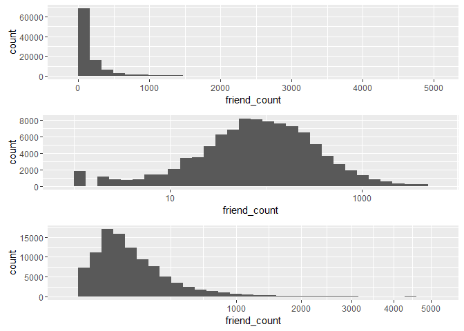

```r
# alternative:
# p1 <- ggplot(aes(x = friend_count), data = pf) + geom_histogram()
# p2 <- p1 + scale_x_log10()
# p3 <- p1 + scale_x_sqrt()
#grid.arrange(p1, p2, p3, ncol=1)
```

***


### Frequency Polygons


```r
qplot(x = friend_count, y = ..count../sum(..count..), 
      data = subset(pf, !is.na(gender)), 
      xlab = 'Friend count',
      ylab = 'Proportion of users with that friend count',
      color = gender , 
      binwidth = 10,
      geom = 'freqpoly') +
  scale_x_continuous(limits = c(0, 1000),
                     breaks = seq(0, 1000, 50)) 
```

```
## Warning: Removed 2949 rows containing non-finite values (stat_bin).
```

```
## Warning: Removed 4 rows containing missing values (geom_path).
```

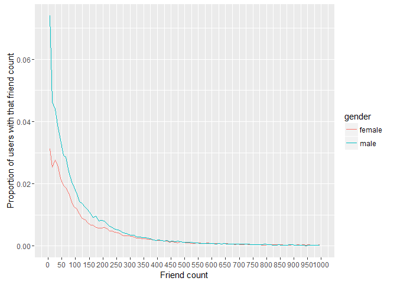

***

### Likes on the Web
Notes:


```r
qplot(x = www_likes, y = ..count../sum(..count..), 
      data = subset(pf, !is.na(gender)), 
      xlab = 'Likes on the WWW',
      ylab = 'Proportion of users with that number of likes',
      color = gender , 
      binwidth = 0.25,
      geom = 'freqpoly') +
  scale_x_continuous(limits = c(0, 10),
                     breaks = seq(0, 10, 1)) + 
  scale_x_log10()
```

```
## Scale for 'x' is already present. Adding another scale for 'x', which
## will replace the existing scale.
```

```
## Warning: Removed 60935 rows containing non-finite values (stat_bin).
```

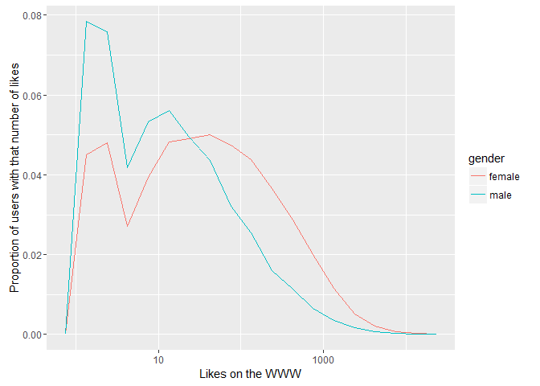

```r
# number of total likes per gender
by(pf$www_likes, pf$gender, sum)
```

```
## pf$gender: female
## [1] 3507665
## -------------------------------------------------------- 
## pf$gender: male
## [1] 1430175
```


***

### Box Plots
Notes:


```r
qplot(x =gender, y = friend_count, 
      data = subset(pf, !is.na(gender)), 
      geom = 'boxplot')
```


#### Adjust the code to focus on users who have friend counts between 0 and 1000.


```r
qplot(x =gender, y = friend_count, 
      data = subset(pf, !is.na(gender)), 
      geom = 'boxplot', ylim = c(0,1000))
```

```
## Warning: Removed 2949 rows containing non-finite values (stat_boxplot).
```


```r
# OR
qplot(x =gender, y = friend_count, 
      data = subset(pf, !is.na(gender)), 
      geom = 'boxplot') +
  scale_y_continuous(limits = c(0,1000))
```

```
## Warning: Removed 2949 rows containing non-finite values (stat_boxplot).
```

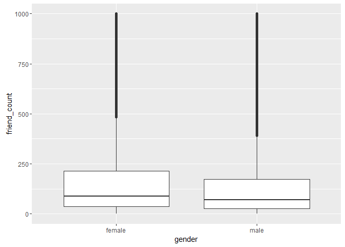

```r
# OR MORE ACCURATELY
qplot(x =gender, y = friend_count, 
      data = subset(pf, !is.na(gender)), 
      geom = 'boxplot') +
  coord_cartesian(ylim = c(0,1000))    # used so the summary output matches the box plot
```

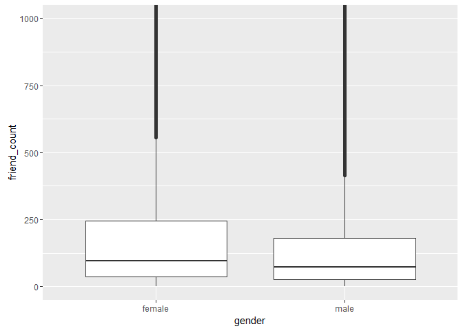

```r
by(pf$friend_count, pf$gender, summary)
```

```
## pf$gender: female
##    Min. 1st Qu.  Median    Mean 3rd Qu.    Max. 
##       0      37      96     242     244    4923 
## -------------------------------------------------------- 
## pf$gender: male
##    Min. 1st Qu.  Median    Mean 3rd Qu.    Max. 
##       0      27      74     165     182    4917
```

***

### Box Plots, Quartiles, and Friendships
Notes:


```r
qplot(x =gender, y = friend_count, 
      data = subset(pf, !is.na(gender)), 
      geom = 'boxplot') +
  coord_cartesian(ylim = c(0,250))
```


#### On average, who initiated more friendships in our sample: men or women?
Response:
#### Write about some ways that you can verify your answer.
Response:

```r
qplot(x =gender, y = friendships_initiated, 
      data = subset(pf, !is.na(gender)), 
      geom = 'boxplot') +
  coord_cartesian(ylim = c(0,150))
```

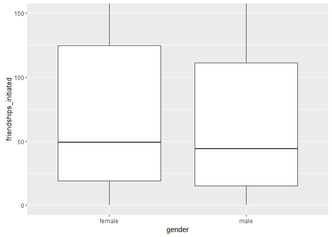

```r
by(pf$friendships_initiated, pf$gender, summary)
```

```
## pf$gender: female
##    Min. 1st Qu.  Median    Mean 3rd Qu.    Max. 
##     0.0    19.0    49.0   113.9   124.8  3654.0 
## -------------------------------------------------------- 
## pf$gender: male
##    Min. 1st Qu.  Median    Mean 3rd Qu.    Max. 
##     0.0    15.0    44.0   103.1   111.0  4144.0
```

Response:

***

### Getting Logical
Notes:


```r
summary(pf$mobile_likes)
```

```
##    Min. 1st Qu.  Median    Mean 3rd Qu.    Max. 
##     0.0     0.0     4.0   106.1    46.0 25110.0
```

```r
qplot(data = pf, x = mobile_likes)+
    scale_x_continuous(limits = c(0, 10),
                     breaks = seq(0, 10, 1))
```

```
## `stat_bin()` using `bins = 30`. Pick better value with `binwidth`.
```

```
## Warning: Removed 40402 rows containing non-finite values (stat_bin).
```

```
## Warning: Removed 2 rows containing missing values (geom_bar).
```

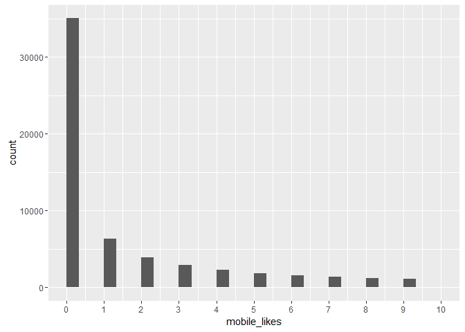

```r
summary(pf$mobile_likes > 0)
```

```
##    Mode   FALSE    TRUE    NA's 
## logical   35056   63947       0
```

```r
mobile_check_in <- NA     # creating a new variable
pf$mobile_check_in <- ifelse(pf$mobile_likes > 0, 1, 0)
pf$mobile_check_in <- factor(pf$mobile_check_in)
summary(pf$mobile_check_in)
```

```
##     0     1 
## 35056 63947
```

```r
# percent of check in using mobile: 65%
sum(pf$mobile_check_in == 1) / length(pf$mobile_check_in)
```

```
## [1] 0.6459097
```

Response:

***

### Analyzing One Variable
Reflection:
look at the data distribution to find insightful information
look for outliers and missing values
plotting the data helps a lot, conveys more information
use data transformation can be very helpful too

***

Click **KnitHTML** to see all of your hard work and to have an html
page of this lesson, your answers, and your notes!
