Lesson 4
========================================================

***

### Scatterplots and Perceived Audience Size

***

### Scatterplots

Load data:

```r
pf <- read.csv('pseudo_facebook.tsv', sep='\t')
names(pf)
```

```
##  [1] "userid"                "age"                  
##  [3] "dob_day"               "dob_year"             
##  [5] "dob_month"             "gender"               
##  [7] "tenure"                "friend_count"         
##  [9] "friendships_initiated" "likes"                
## [11] "likes_received"        "mobile_likes"         
## [13] "mobile_likes_received" "www_likes"            
## [15] "www_likes_received"
```

```r
library(ggplot2)
qplot(x= age, y = friend_count ,data = pf)
```

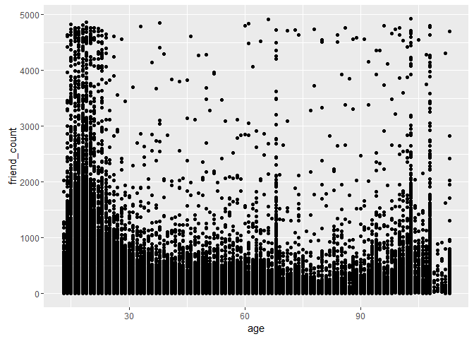

### ggplot Syntax
Notes:


```r
ggplot(aes(x= age, y = friend_count) , data = pf) + 
  geom_point( alpha=1/20)    # set the transparency of the points using the alpha parameter (to address overplotting)
```

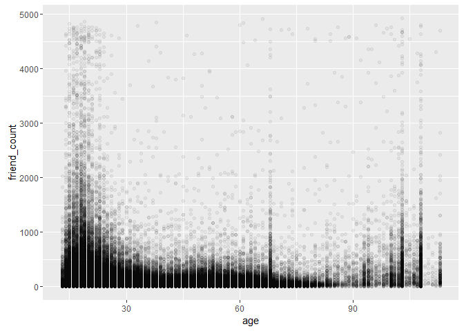

```r
                             # use geom_point to create a scatterplot
```

***

### Overplotting

```r
ggplot(aes(x= age, y = friend_count) , data = pf) + 
  geom_jitter(alpha=1/20) +   # add some noise to have a more intuitive representation
  xlim(13,90)                # between age 13 to 90, to remove some anomalies
```


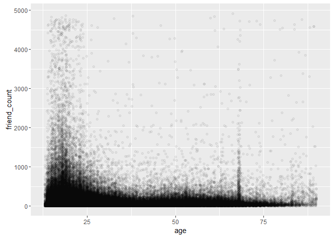

***

### Coord_trans()

```r
ggplot(aes(x= age, y = friend_count) , data = pf) + 
  geom_point(alpha=1/20) +   # add some noise to have a more intuitive representation
  xlim(13,90) +               # between age 13 to 90, to remove some anomalies
  coord_trans(y = 'sqrt')
```

-1.png)

#### Look up the documentation for coord_trans() and add a layer to the plot that transforms friend_count using the square root function. Create your plot!


```r
ggplot(aes(x= age, y = friend_count) , data = pf) + 
  geom_point(alpha=1/20) +   # back to geom_point
  xlim(13,90) +               # between age 13 to 90, to remove some anomalies
  coord_trans(y = 'sqrt')
```

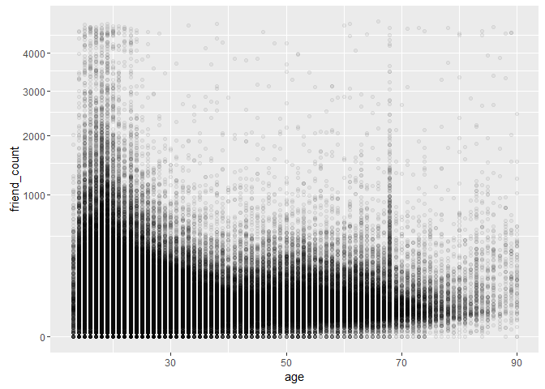

### Alpha and Jitter

```r
ggplot(aes(x= age, y = friend_count) , data = pf) + 
  geom_point(alpha=1/20, position = position_jitter(h=0)) +   # add some noise, but need to be careful with negative friend count
  xlim(13,90) +               # between age 13 to 90, to remove some anomalies
  coord_trans(y = 'sqrt')
```

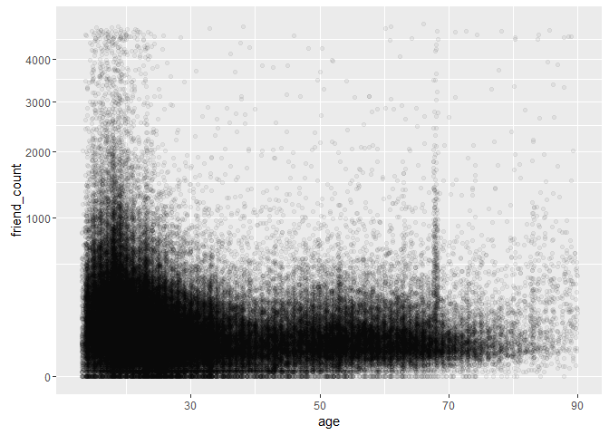

***

### Relationship between friends initiated  vs age

```r
ggplot(aes(x= age, y = friendships_initiated) , data = pf) + 
  geom_jitter(alpha=1/10, position = position_jitter(h=0)) +   # add some noise, but need to be careful with negative number
  xlim(13,90) +               # between age 13 to 90, to remove some anomalies
  coord_trans(y = 'sqrt')
```

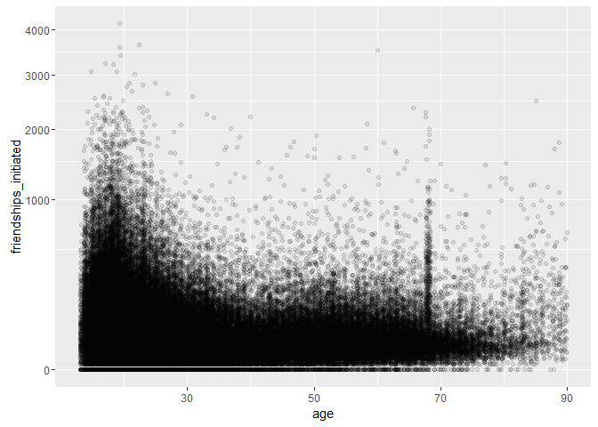

***

### Conditional Means

```r
library(dplyr)                  # allows to split up a dataframe and apply functions
```

```r
#most important functions are:
#filter()
#group_by()
#mutate()
#arrange()

age_groups <- group_by(pf, age)     # first groups data by age

pf.fc_by_age <- summarise(age_groups,                 # then summarizes
          friend_count_mean = mean(friend_count),     # and creates 3 new variables
          friend_count_median = median(friend_count),
          n = n()                                      # number of items in each group
          )

pf.fc_by_age <- arrange(pf.fc_by_age, age)                 # and sort by age

pf.fc_by_age
```

```
## Source: local data frame [101 x 4]
## 
##      age friend_count_mean friend_count_median     n
##    (int)             (dbl)               (dbl) (int)
## 1     13          164.7500                74.0   484
## 2     14          251.3901               132.0  1925
## 3     15          347.6921               161.0  2618
## 4     16          351.9371               171.5  3086
## 5     17          350.3006               156.0  3283
## 6     18          331.1663               162.0  5196
## 7     19          333.6921               157.0  4391
## 8     20          283.4991               135.0  3769
## 9     21          235.9412               121.0  3671
## 10    22          211.3948               106.0  3032
## ..   ...               ...                 ...   ...
```

### Conditional Means

```r
library(dplyr)                  # allows to split up a dataframe and apply functions

# alternatively, it is possible to chain the commands:
pf.fc_by_age <- pf %>%
  group_by(age) %>%
  summarise(friend_count_mean = mean(friend_count),     # and creates 3 new variables
          friend_count_median = median(friend_count),
          n = n() ) %>%
  arrange(age) 

pf.fc_by_age
```

```
## Source: local data frame [101 x 4]
## 
##      age friend_count_mean friend_count_median     n
##    (int)             (dbl)               (dbl) (int)
## 1     13          164.7500                74.0   484
## 2     14          251.3901               132.0  1925
## 3     15          347.6921               161.0  2618
## 4     16          351.9371               171.5  3086
## 5     17          350.3006               156.0  3283
## 6     18          331.1663               162.0  5196
## 7     19          333.6921               157.0  4391
## 8     20          283.4991               135.0  3769
## 9     21          235.9412               121.0  3671
## 10    22          211.3948               106.0  3032
## ..   ...               ...                 ...   ...
```


Create your plot!

```r
ggplot(aes(x= age, y = friend_count_mean) , data = pf.fc_by_age) + 
  geom_line()              # creates a line graph
```


***

### Overlaying Summaries with Raw Data

```r
ggplot(aes(x= age, y = friend_count) , data = pf) + 
  coord_cartesian(xlim = c(13, 70), ylim = c(0, 1000)) +  # used to zoom in (instead of xlim layer)
  #coord_trans(y = 'sqrt') +    either coord_trans or coord_cartesian
  geom_point(alpha=1/20, 
             position = position_jitter(h=0),
             color = 'orange') +   # add some noise, but need to be careful with negative friend count
  geom_line(stat = 'summary', fun.y = mean) +    # overlay the mean (= 'conditional mean')
  geom_line(stat = 'summary', fun.y = quantile, fun.args = list(probs = 0.1),
            linetype = 2, color ='blue') + #overlay the 10th percentile (the first 10%)
  geom_line(stat = 'summary', fun.y = quantile, fun.args = list(probs = 0.5),
            color ='blue') + #overlay the median (the first 50%)
  geom_line(stat = 'summary', fun.y = quantile, fun.args = list(probs = 0.9),
            linetype = 2, color ='blue')   #overlay the 90th percentile (the first 90%)
```

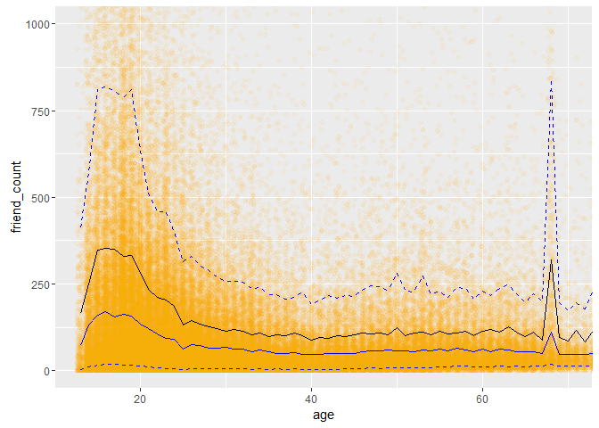

***

### Correlation

```r
cor(pf$age, pf$friend_count)
```

```
## [1] -0.02740737
```

```r
#or
cor.test(pf$age, pf$friend_count, method="pearson")
```

```
## 
## 	Pearson's product-moment correlation
## 
## data:  pf$age and pf$friend_count
## t = -8.6268, df = 99001, p-value < 2.2e-16
## alternative hypothesis: true correlation is not equal to 0
## 95 percent confidence interval:
##  -0.03363072 -0.02118189
## sample estimates:
##         cor 
## -0.02740737
```

Look up the documentation for the cor.test function.

What's the correlation between age and friend count? Round to three decimal places.
Response: -0.027

***

### Correlation on Subsets

```r
with( pf[ pf$age <= 70 ,]  , cor.test(age, friend_count, method="pearson"))
```

```
## 
## 	Pearson's product-moment correlation
## 
## data:  age and friend_count
## t = -52.592, df = 91029, p-value < 2.2e-16
## alternative hypothesis: true correlation is not equal to 0
## 95 percent confidence interval:
##  -0.1780220 -0.1654129
## sample estimates:
##        cor 
## -0.1717245
```

***

## Create Scatterplots
Notes: scatterplot of likes_received (y) vs. www_likes_received (x)

```r
ggplot(aes(x= www_likes_received, y = likes_received) , data = pf) + 
  geom_point() +
  xlim(0, quantile(pf$www_likes_received, probs = 0.95)) +   # 95% percentile on x variable
  ylim(0, quantile(pf$likes_received, probs = 0.95))       # 95% percentile on y variable
```

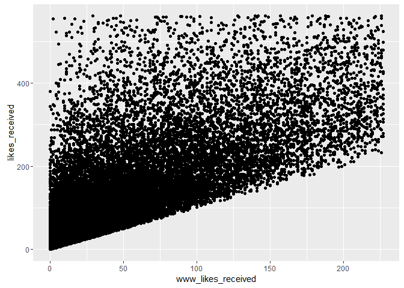

***

### Strong Correlations

```r
ggplot(aes(x= www_likes_received, y = likes_received) , data = pf) + 
  geom_point() +
  xlim(0, quantile(pf$www_likes_received, probs = 0.95)) +   # 95% percentile on x variable
  ylim(0, quantile(pf$likes_received, probs = 0.95)) +       # 95% percentile on y variable
  geom_smooth(method = 'lm', color = 'red')      # adding linear regression
```


What's the correlation betwen the two variables? Include the top 5% of values for the variable in the calculation and round to 3 decimal places.


```r
#cor(pf$www_likes_received,pf$likes_received)     # provides a number
cor.test(pf$www_likes_received,pf$likes_received)  # provides a report
```

```
## 
## 	Pearson's product-moment correlation
## 
## data:  pf$www_likes_received and pf$likes_received
## t = 937.1, df = 99001, p-value < 2.2e-16
## alternative hypothesis: true correlation is not equal to 0
## 95 percent confidence interval:
##  0.9473553 0.9486176
## sample estimates:
##       cor 
## 0.9479902
```

Response: Correlation is 0.94

***

### More Caution with Correlation

```r
#install.packages('car',dependencies=TRUE)
#install.packages('alr3',dependencies=TRUE)
#install.packages('nlme')
library(car)
library(alr3)
```

```r
data(Mitchell)
?Mitchell
```

Create your plot!

```r
library(ggplot2)
ggplot(aes(x= Mitchell$Month, y= Mitchell$Temp) , data = Mitchell) + 
  geom_point()
```

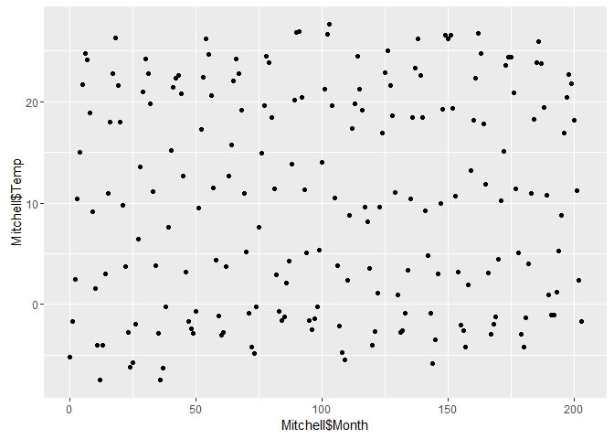

***

### Noisy Scatterplots
a. Take a guess for the correlation coefficient for the scatterplot.
0

b. What is the actual correlation of the two variables?
(Round to the thousandths place)
0.05


```r
cor.test(Mitchell$Month,Mitchell$Temp)
```

```
## 
## 	Pearson's product-moment correlation
## 
## data:  Mitchell$Month and Mitchell$Temp
## t = 0.81816, df = 202, p-value = 0.4142
## alternative hypothesis: true correlation is not equal to 0
## 95 percent confidence interval:
##  -0.08053637  0.19331562
## sample estimates:
##        cor 
## 0.05747063
```

***

### Making Sense of Data
Notes:


```r
ggplot(aes(x= Mitchell$Month, y= Mitchell$Temp) , data = Mitchell) + 
  geom_point() +
  scale_x_discrete(breaks = seq(0,203,11))   # making month discrete
```

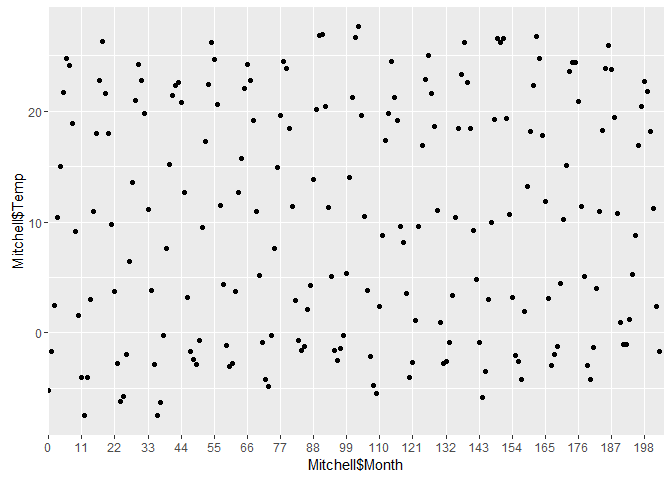

***

### Understanding Noise: Age to Age Months

```r
pf <- read.csv('pseudo_facebook.tsv', sep='\t')
names(pf)
```

```
##  [1] "userid"                "age"                  
##  [3] "dob_day"               "dob_year"             
##  [5] "dob_month"             "gender"               
##  [7] "tenure"                "friend_count"         
##  [9] "friendships_initiated" "likes"                
## [11] "likes_received"        "mobile_likes"         
## [13] "mobile_likes_received" "www_likes"            
## [15] "www_likes_received"
```

```r
ggplot(aes(x= age, y= friend_count_mean) , data = pf.fc_by_age) + 
  geom_line() 
```


```r
head(pf.fc_by_age, 10)
```

```
## Source: local data frame [10 x 4]
## 
##      age friend_count_mean friend_count_median     n
##    (int)             (dbl)               (dbl) (int)
## 1     13          164.7500                74.0   484
## 2     14          251.3901               132.0  1925
## 3     15          347.6921               161.0  2618
## 4     16          351.9371               171.5  3086
## 5     17          350.3006               156.0  3283
## 6     18          331.1663               162.0  5196
## 7     19          333.6921               157.0  4391
## 8     20          283.4991               135.0  3769
## 9     21          235.9412               121.0  3671
## 10    22          211.3948               106.0  3032
```

```r
pf.fc_by_age[17:19,]
```

```
## Source: local data frame [3 x 4]
## 
##     age friend_count_mean friend_count_median     n
##   (int)             (dbl)               (dbl) (int)
## 1    29          120.8182                66.0  1936
## 2    30          115.2080                67.5  1716
## 3    31          118.4599                63.0  1694
```

***

### Age with Months Means


```r
pf$age_with_months <- pf$age + (12 - pf$dob_month) / 12
```

Programming Assignment

```r
library(dplyr)                  # allows to split up a dataframe and apply functions

age_with_months_groups <- group_by(pf, age_with_months)     # first groups data by age_with_months

pf.fc_by_age_months <- summarise(age_with_months_groups,    # then summarizes
          friend_count_mean = mean(friend_count),     # and creates 3 new variables
          friend_count_median = median(friend_count),
          n = n()                                      # number of items in each group
          )

pf.fc_by_age_months <- arrange(pf.fc_by_age_months, age_with_months)  # and sort by age w/ months

pf.fc_by_age_months
```

```
## Source: local data frame [1,194 x 4]
## 
##    age_with_months friend_count_mean friend_count_median     n
##              (dbl)             (dbl)               (dbl) (int)
## 1         13.16667          46.33333                30.5     6
## 2         13.25000         115.07143                23.5    14
## 3         13.33333         136.20000                44.0    25
## 4         13.41667         164.24242                72.0    33
## 5         13.50000         131.17778                66.0    45
## 6         13.58333         156.81481                64.0    54
## 7         13.66667         130.06522                75.5    46
## 8         13.75000         205.82609               122.0    69
## 9         13.83333         215.67742               111.0    62
## 10        13.91667         162.28462                71.0   130
## ..             ...               ...                 ...   ...
```

***

### Noise in Conditional Means

```r
ggplot(aes(x= age_with_months, y = friend_count_mean) , data = pf.fc_by_age_months) + 
  geom_line()  +
  coord_cartesian(xlim = c(13, 70), ylim = c(0, 450))
```

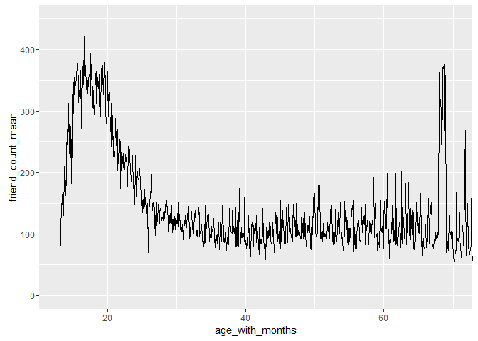

***

### Comparing Conditional Means

```r
p1 <- ggplot(aes(x= age, y = friend_count_mean) , 
             data = subset(pf.fc_by_age, age<71)) + 
  geom_line()

p2 <- ggplot(aes(x= age_with_months, y = friend_count_mean) , 
             data = subset(pf.fc_by_age_months, age_with_months<71)) + 
  geom_line() 

p3 <- ggplot(aes(x= round(age/5)*5, y = friend_count) , 
             data = subset(pf, age<71)) + 
  geom_line(stat = 'summary', fun.y = mean) 

library(gridExtra)
grid.arrange(p2,p1,p3,ncol=1)
```

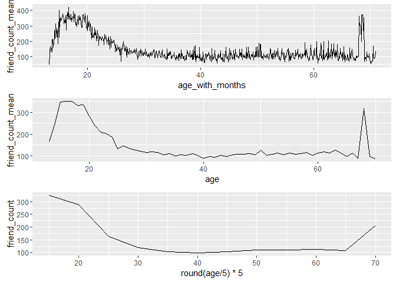

***

### Smoothing Conditional Means

```r
p1 <- ggplot(aes(x= age, y = friend_count_mean) , 
             data = subset(pf.fc_by_age, age<71)) + 
  geom_line() +
  geom_smooth()              # adding a Local Regression plot (LOESS)

p2 <- ggplot(aes(x= age_with_months, y = friend_count_mean) , 
             data = subset(pf.fc_by_age_months, age_with_months<71)) + 
  geom_line() +
  geom_smooth()             # adding a Local Regression plot (LOESS)

p3 <- ggplot(aes(x= round(age/5)*5, y = friend_count) , 
             data = subset(pf, age<71)) + 
  geom_line(stat = 'summary', fun.y = mean) 

library(gridExtra)
grid.arrange(p2,p1,p3,ncol=1)
```

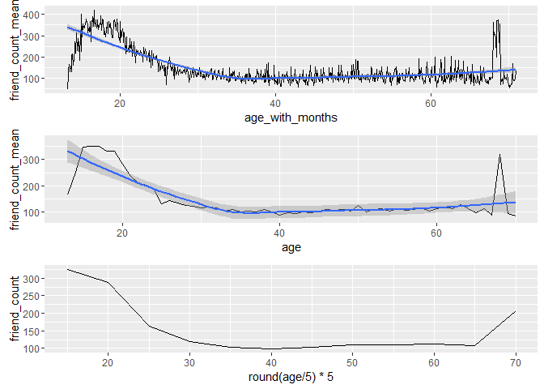
