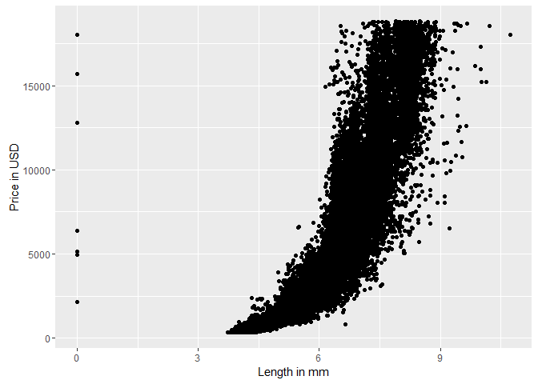
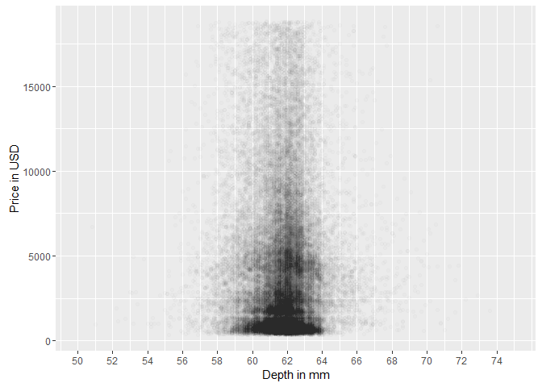
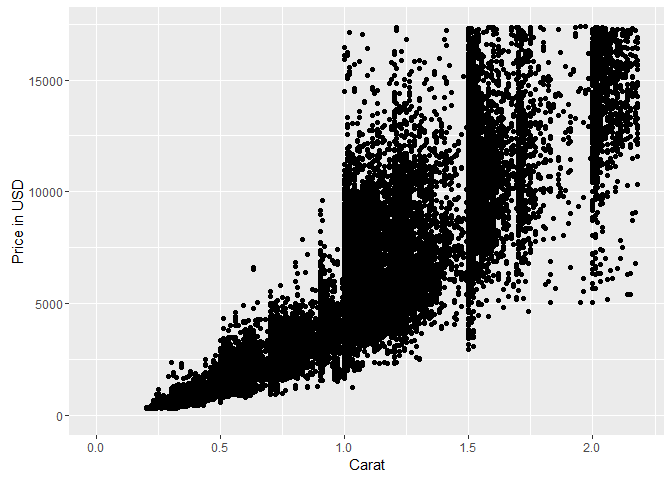
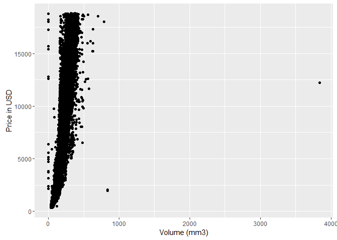
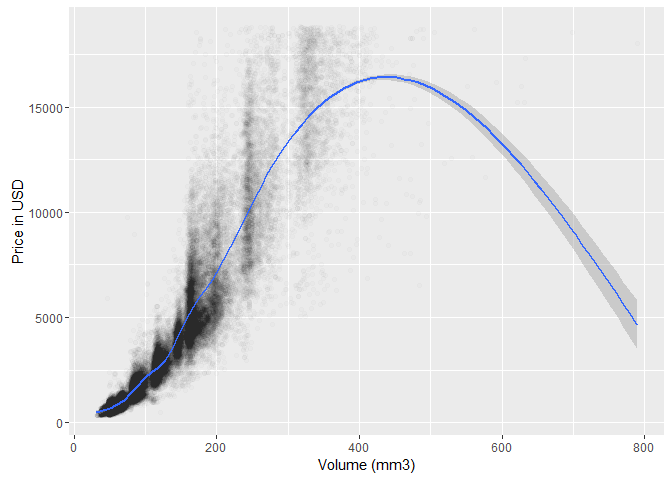
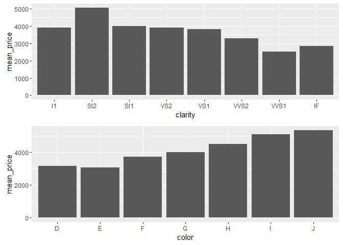
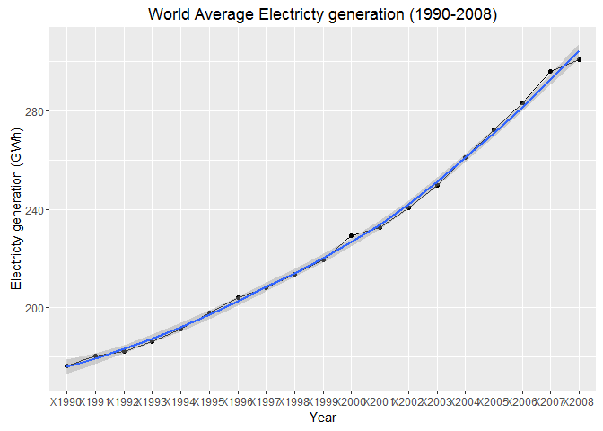
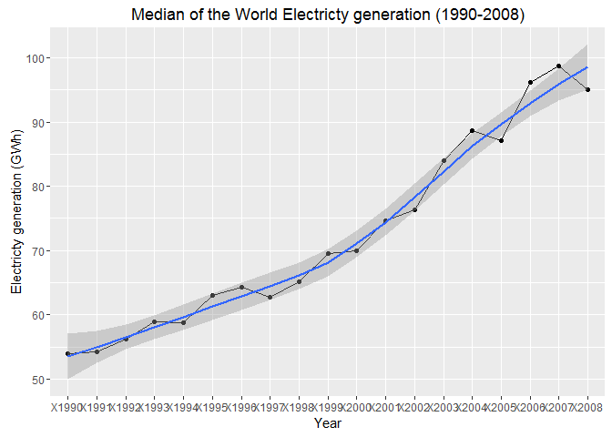
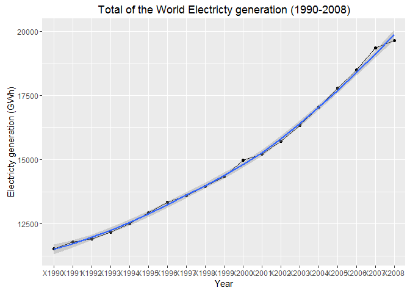
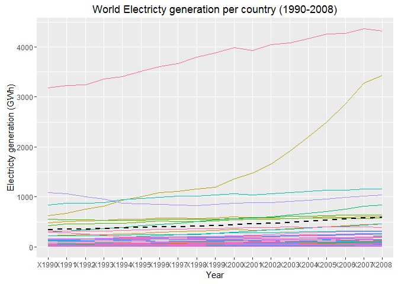

# Problem Data Set 4
Nicolas  
March 15, 2016  


Problem Set 4 : Diamonds (continued)
========================================================

***

### Loading the dataset


```r
library(ggplot2)
getwd()
```

```
## [1] "C:/Users/Nicolas/Desktop/Projets Tech/Data Analysis with R/Lesson 4"
```

```r
setwd('C:/Users/Nicolas/Desktop/Projets Tech/Data Analysis with R/')
list.files()
```

```
##  [1] "Archive"                            
##  [2] "BigDiamonds.Rda"                    
##  [3] "birthdaysExample.csv"               
##  [4] "Electricity Generation.csv"         
##  [5] "Final Project"                      
##  [6] "Learning Resources"                 
##  [7] "Lesson 3"                           
##  [8] "Lesson 4"                           
##  [9] "Lesson1.R"                          
## [10] "Lesson2.R"                          
## [11] "lesson5.rmd"                        
## [12] "lesson6.rmd"                        
## [13] "nci.tsv"                            
## [14] "priceHistogram.png"                 
## [15] "Problem Set 5.rmd"                  
## [16] "pseudo_facebook.tsv"                
## [17] "reddit.csv"                         
## [18] "stateData.csv"                      
## [19] "Test drive R Markdown on Github.url"
## [20] "What_is_a_RMD_file.Rmd"             
## [21] "yogurt.csv"
```

```r
data(diamonds)
summary(diamonds)
```

```
##      carat               cut        color        clarity     
##  Min.   :0.2000   Fair     : 1610   D: 6775   SI1    :13065  
##  1st Qu.:0.4000   Good     : 4906   E: 9797   VS2    :12258  
##  Median :0.7000   Very Good:12082   F: 9542   SI2    : 9194  
##  Mean   :0.7979   Premium  :13791   G:11292   VS1    : 8171  
##  3rd Qu.:1.0400   Ideal    :21551   H: 8304   VVS2   : 5066  
##  Max.   :5.0100                     I: 5422   VVS1   : 3655  
##                                     J: 2808   (Other): 2531  
##      depth           table           price             x         
##  Min.   :43.00   Min.   :43.00   Min.   :  326   Min.   : 0.000  
##  1st Qu.:61.00   1st Qu.:56.00   1st Qu.:  950   1st Qu.: 4.710  
##  Median :61.80   Median :57.00   Median : 2401   Median : 5.700  
##  Mean   :61.75   Mean   :57.46   Mean   : 3933   Mean   : 5.731  
##  3rd Qu.:62.50   3rd Qu.:59.00   3rd Qu.: 5324   3rd Qu.: 6.540  
##  Max.   :79.00   Max.   :95.00   Max.   :18823   Max.   :10.740  
##                                                                  
##        y                z         
##  Min.   : 0.000   Min.   : 0.000  
##  1st Qu.: 4.720   1st Qu.: 2.910  
##  Median : 5.710   Median : 3.530  
##  Mean   : 5.735   Mean   : 3.539  
##  3rd Qu.: 6.540   3rd Qu.: 4.040  
##  Max.   :58.900   Max.   :31.800  
## 
```

***

### Create a scatterplot of price vs x


```r
ggplot(aes(x = x, y = price), data = diamonds) +
       xlab('Length in mm') +
       ylab('Price in USD') + 
  geom_point()
```



***

### Correlation between price and x, between price and y, between price and z


```r
cor.test(diamonds$price,diamonds$x)  # length in mm
```

```
## 
## 	Pearson's product-moment correlation
## 
## data:  diamonds$price and diamonds$x
## t = 440.16, df = 53938, p-value < 2.2e-16
## alternative hypothesis: true correlation is not equal to 0
## 95 percent confidence interval:
##  0.8825835 0.8862594
## sample estimates:
##       cor 
## 0.8844352
```

```r
cor.test(diamonds$price,diamonds$y)  # width in mm
```

```
## 
## 	Pearson's product-moment correlation
## 
## data:  diamonds$price and diamonds$y
## t = 401.14, df = 53938, p-value < 2.2e-16
## alternative hypothesis: true correlation is not equal to 0
## 95 percent confidence interval:
##  0.8632867 0.8675241
## sample estimates:
##       cor 
## 0.8654209
```

```r
cor.test(diamonds$price,diamonds$z)  # depth in mm
```

```
## 
## 	Pearson's product-moment correlation
## 
## data:  diamonds$price and diamonds$z
## t = 393.6, df = 53938, p-value < 2.2e-16
## alternative hypothesis: true correlation is not equal to 0
## 95 percent confidence interval:
##  0.8590541 0.8634131
## sample estimates:
##       cor 
## 0.8612494
```

***

### Create a scatterplot of price vs depth

Change the code to make the transparency of the
points to be 1/100 of what they are now and mark
the x-axis every 2 units.


```r
ggplot(aes(x = depth, y = price), data = diamonds) +
       xlab('Depth in mm') +
       ylab('Price in USD') + 
  geom_point(alpha=1/100) +
  scale_x_continuous(limits = c(50, 75),
                     breaks = seq(50,75, 2))    # mark the x-axis every 2 units
```

```
## Warning: Removed 6 rows containing missing values (geom_point).
```



***

### Correlation between price and depth


```r
cor.test(diamonds$price,diamonds$depth)  # depth: total depth percentage = z / mean(x, y) = 2 * z / (x + y) (43-79)
```

```
## 
## 	Pearson's product-moment correlation
## 
## data:  diamonds$price and diamonds$depth
## t = -2.473, df = 53938, p-value = 0.0134
## alternative hypothesis: true correlation is not equal to 0
## 95 percent confidence interval:
##  -0.019084756 -0.002208537
## sample estimates:
##        cor 
## -0.0106474
```

***

### Create a scatterplot of price vs carat

and omit the top 1% of price and carat values.


```r
ggplot(aes(x = carat, y = price), data = diamonds) +
       xlab('Carat') +
       ylab('Price in USD') + 
  geom_point() +
  xlim(0, quantile(diamonds$carat, probs = 0.99)) +   # 99% percentile on x variable
  ylim(0, quantile(diamonds$price, probs = 0.99))       # 99% percentile on y variable
```

```
## Warning: Removed 926 rows containing missing values (geom_point).
```



***

### Create a scatterplot of price vs volume (x*y*z)


```r
diamonds$volume <- diamonds$x * diamonds$y * diamonds$z

ggplot(aes(x = volume, y = price), data = diamonds) +
       xlab('Volume (mm3)') +
       ylab('Price in USD') + 
  geom_point() 
```



```r
# number of diamonds with volume=0
dim(diamonds[diamonds$volume == 0,])
```

```
## [1] 20 11
```

```r
# Answer is 20.
```

***

### Correlation between price vs volume (x*y*z)

Exclude diamonds with volume=0 and volume >= 800


```r
temp_df <- diamonds[ diamonds$volume > 0 & diamonds$volume <= 800 , ]

cor.test(temp_df$price,temp_df$volume)
```

```
## 
## 	Pearson's product-moment correlation
## 
## data:  temp_df$price and temp_df$volume
## t = 559.19, df = 53915, p-value < 2.2e-16
## alternative hypothesis: true correlation is not equal to 0
## 95 percent confidence interval:
##  0.9222944 0.9247772
## sample estimates:
##       cor 
## 0.9235455
```

***

### Create a scatterplot of price vs volume (x*y*z)


```r
temp_df <- diamonds[ diamonds$volume > 0 & diamonds$volume <= 800 , ]

ggplot(aes(x = volume, y = price), data = temp_df) +
       xlab('Volume (mm3)') +
       ylab('Price in USD') + 
  geom_point(alpha=1/100) +
  geom_smooth()
```



The linear model is not a good fit.

***

### Create a new data frame containing info on diamonds by clarity


```r
library(dplyr)
```

```
## 
## Attaching package: 'dplyr'
```

```
## The following objects are masked from 'package:stats':
## 
##     filter, lag
```

```
## The following objects are masked from 'package:base':
## 
##     intersect, setdiff, setequal, union
```

```r
clarity_groups  <- group_by(diamonds,clarity)     # first groups data by clarity

diamondsByClarity <- summarise(clarity_groups,                 # then summarizes
          mean_price = mean(price),                    # and creates new variables
          median_price = median(price),
          min_price = min(price),
          max_price = max(price),
          n = n()                                      # number of items in each group
          )

diamondsByClarity
```

```
## Source: local data frame [8 x 6]
## 
##   clarity mean_price median_price min_price max_price     n
##    (fctr)      (dbl)        (dbl)     (int)     (int) (int)
## 1      I1   3924.169         3344       345     18531   741
## 2     SI2   5063.029         4072       326     18804  9194
## 3     SI1   3996.001         2822       326     18818 13065
## 4     VS2   3924.989         2054       334     18823 12258
## 5     VS1   3839.455         2005       327     18795  8171
## 6    VVS2   3283.737         1311       336     18768  5066
## 7    VVS1   2523.115         1093       336     18777  3655
## 8      IF   2864.839         1080       369     18806  1790
```

Note : Note: If you used the count() function from the plyr package before this exercise. You need to run this command to unload the plyr package. 
detach("package:plyr", unload=TRUE) 

***

### Create two bar plots : mean_price vs. clarity, mean_price vs. color


```r
library(dplyr)
library(ggplot2)

diamonds_by_clarity <- group_by(diamonds, clarity)
diamonds_mp_by_clarity <- summarise(diamonds_by_clarity, mean_price = mean(price))
p1 <- ggplot(aes(x = clarity, y = mean_price), data = diamonds_mp_by_clarity) +
  geom_bar(stat="identity")

diamonds_by_color <- group_by(diamonds, color)
diamonds_mp_by_color <- summarise(diamonds_by_color, mean_price = mean(price))
p2 <- ggplot(aes(x = color, y = mean_price), data = diamonds_mp_by_color) +
  geom_bar(stat="identity")

library(gridExtra)
grid.arrange(p1,p2,ncol=1)
```



***

###  Gapminder Revisited : Energy use in the world, per person

Your task is to continue the investigation you did at the end of Problem Set 3.
In your investigation, examine pairs of variable and create 2-5 plots that make
use of the techniques from Lesson 4.

# Loading data


```r
setwd('C:/Users/Nicolas/Desktop/Projets Tech/Data Analysis with R/')

electricity_df <- read.csv('Electricity Generation.csv', stringsAsFactors=FALSE
                        ,sep=",",head=TRUE)

rownames(electricity_df) <- electricity_df$country   # change the row names with the country names
electricity_df$country <- NULL   # remove the country name column
electricity_df <- as.data.frame( t(electricity_df) )  # and tranpose
electricity_df2 <- electricity_df
```

# Average electricty generation in the world in 1990 


```r
library(ggplot2)

electricity_df$Mean <- apply(electricity_df, 1, FUN = mean)   # add a new column 'Mean'

ggplot(aes(x = row.names(electricity_df), y = Mean/10^9,  group = 1), #  all points should be connected, so group=1
       data = electricity_df) +
  geom_line() + geom_point() + geom_smooth() +
  ggtitle('World Average Electricty generation (1990-2008)')+
  xlab('Year') +
  ylab('Electricty generation (GWh)')
```



# Median electricty generation in the world in 1990 


```r
library(ggplot2)

electricity_df$Median <- apply(electricity_df, 1, FUN = median)   # add a new column 'Median'

ggplot(aes(x = row.names(electricity_df), y = Median/10^9,  group = 1), #  all points should be connected, so group=1
       data = electricity_df) +
  geom_line() + geom_point() + geom_smooth() +
  ggtitle('Median of the World Electricty generation (1990-2008)')+
  xlab('Year') +
  ylab('Electricty generation (GWh)')
```



# Total electricty generation in the world in 1990


```r
library(ggplot2)

electricity_df$Total <- apply(electricity_df, 1, FUN = sum)   # add a new column 'Total'

ggplot(aes(x = row.names(electricity_df), y = Total/10^9,  group = 1), #  all points should be connected, so group=1
       data = electricity_df) +
  geom_line() + geom_point() + geom_smooth() +
  ggtitle('Total of the World Electricty generation (1990-2008)')+
  xlab('Year') +
  ylab('Electricty generation (GWh)')
```



# Electricty generation in the world in X in 1990 compared to the average and median


```r
library(reshape2)
electricity_df$Mean <- apply(electricity_df, 1, FUN = mean)   # add a new column 'Mean'
electricity_df_long <- as.data.frame(melt(as.matrix(electricity_df2)))  # to be able to plot multiple column, first convert the df from wide format to long format (here with melt, same as Tidyr's Gather function). Note: melt as a matrix first in order to be able to use the rownames as a variable.

head(electricity_df_long)
```

```
##    Var1    Var2      value
## 1 X1990 Algeria 1.6104e+10
## 2 X1991 Algeria 1.7345e+10
## 3 X1992 Algeria 1.8286e+10
## 4 X1993 Algeria 1.9415e+10
## 5 X1994 Algeria 1.9883e+10
## 6 X1995 Algeria 1.9715e+10
```

```r
ggplot() + 
  geom_line(data=electricity_df_long, aes(x=Var1, y=value/10^9, colour=Var2, group=Var2)) + 
  theme(legend.position = "none") +
  ggtitle('World Electricty generation per country (1990-2008)') +
  xlab('Year') +
  ylab('Electricty generation (GWh)') + 
  geom_line(data = electricity_df, aes(x = row.names(electricity_df), y = Mean/10^9),linetype = 2, color ='black',size=1, group=1)
```



Alternatively, using summary stat:


```r
library(dplyr)

year_groups <- group_by(electricity_df_long, Var1)     # first groups data by year

data_by_year <- summarise(year_groups,
          generation_mean = mean(value) 
          )

data_by_year <- arrange(data_by_year, Var1)                 # and sort by year

data_by_year
```

```
## Source: local data frame [19 x 2]
## 
##      Var1 generation_mean
##    (fctr)           (dbl)
## 1   X1990    176355868813
## 2   X1991    180446875906
## 3   X1992    182267008234
## 4   X1993    186478653203
## 5   X1994    191320678063
## 6   X1995    197912788219
## 7   X1996    204088507125
## 8   X1997    208157059359
## 9   X1998    213747399250
## 10  X1999    219347951250
## 11  X2000    229157380297
## 12  X2001    232743624219
## 13  X2002    240717467188
## 14  X2003    249841476563
## 15  X2004    261030735328
## 16  X2005    272081673786
## 17  X2006    283157749694
## 18  X2007    296053681041
## 19  X2008    300497448713
```

```r
ggplot() + 
  geom_line(data=electricity_df_long, aes(x=Var1, y=value/10^9, colour=Var2, group=Var2)) + 
  theme(legend.position = "none") +
  ggtitle('World Electricty generation per country (1990-2008)') +
  xlab('Year') +
  ylab('Electricty generation (GWh)') + 
  geom_line(data = data_by_year, aes(x = Var1, y = generation_mean/10^9),linetype = 2, color ='black',size=1, group=1)
```


Alternatively, overlaying Summaries with Raw Data:


```r
ggplot(data=electricity_df_long, aes(x=Var1, y=value/10^9, colour=Var2, group=Var2)) + 
  geom_line() + 
  geom_line(stat = 'summary', fun.y = mean, linetype = 2, color ='blue',size=1, group=1) +
  theme(legend.position = "none") +
  ggtitle('World Electricty generation per country (1990-2008)') +
  xlab('Year') +
  ylab('Electricty generation (GWh)')
```


