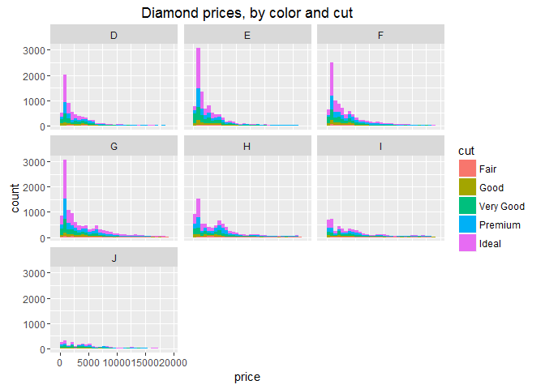
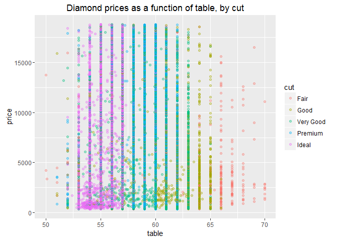
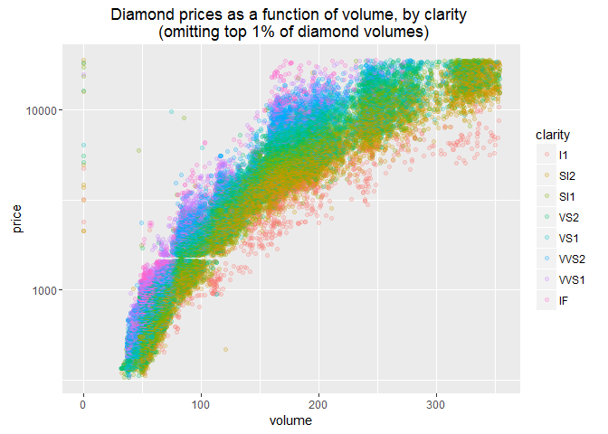
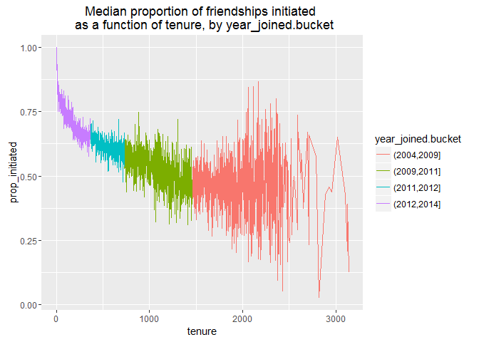
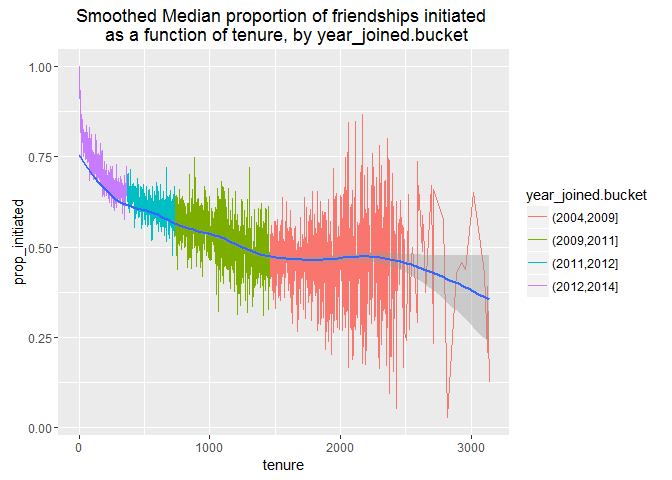
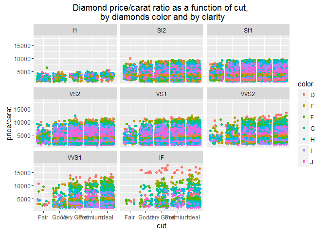
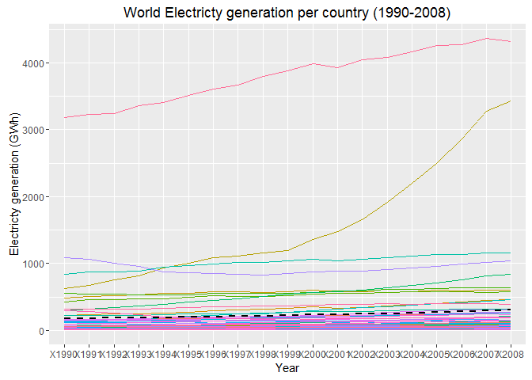

# Problem Set 5
Nicolas  
March 26, 2016  

Problem Set 5 : Diamonds (continued)
========================================================

***

### Loading the dataset


```r
library(ggplot2)
data(diamonds)
summary(diamonds)
```

```
##      carat               cut        color        clarity     
##  Min.   :0.2000   Fair     : 1610   D: 6775   SI1    :13065  
##  1st Qu.:0.4000   Good     : 4906   E: 9797   VS2    :12258  
##  Median :0.7000   Very Good:12082   F: 9542   SI2    : 9194  
##  Mean   :0.7979   Premium  :13791   G:11292   VS1    : 8171  
##  3rd Qu.:1.0400   Ideal    :21551   H: 8304   VVS2   : 5066  
##  Max.   :5.0100                     I: 5422   VVS1   : 3655  
##                                     J: 2808   (Other): 2531  
##      depth           table           price             x         
##  Min.   :43.00   Min.   :43.00   Min.   :  326   Min.   : 0.000  
##  1st Qu.:61.00   1st Qu.:56.00   1st Qu.:  950   1st Qu.: 4.710  
##  Median :61.80   Median :57.00   Median : 2401   Median : 5.700  
##  Mean   :61.75   Mean   :57.46   Mean   : 3933   Mean   : 5.731  
##  3rd Qu.:62.50   3rd Qu.:59.00   3rd Qu.: 5324   3rd Qu.: 6.540  
##  Max.   :79.00   Max.   :95.00   Max.   :18823   Max.   :10.740  
##                                                                  
##        y                z         
##  Min.   : 0.000   Min.   : 0.000  
##  1st Qu.: 4.720   1st Qu.: 2.910  
##  Median : 5.710   Median : 3.530  
##  Mean   : 5.735   Mean   : 3.539  
##  3rd Qu.: 6.540   3rd Qu.: 4.040  
##  Max.   :58.900   Max.   :31.800  
## 
```

***

### Create a histogram of diamond prices
Facet the histogram by diamond color
and use cut to color the histogram bars.


```r
ggplot(aes(price), data = diamonds) + 
  geom_histogram(aes(fill = cut) ) +
  facet_wrap(~color) +
  ggtitle('Diamond prices, by color and cut')
```

```
## `stat_bin()` using `bins = 30`. Pick better value with `binwidth`.
```



***

### Create a scatterplot of diamond prices
Create a scatterplot of diamond price vs.
table and color the points by the cut of
the diamond


```r
ggplot(aes(x=table, y=price), data = diamonds) + 
  geom_point(alpha=1/3, aes(color = cut)) +
  scale_x_continuous(limits = c(50, 70),
                     breaks = seq(50, 70, 5)) + 
  ggtitle('Diamond prices as a function of table, by cut')
```

```
## Warning: Removed 12 rows containing missing values (geom_point).
```



***

### Create a scatterplot of diamond prices
Create a scatterplot of diamond price vs.
volume (x * y * z) and color the points by
the clarity of diamonds. Use scale on the y-axis
to take the log10 of price. You should also
omit the top 1% of diamond volumes from the plot.


```r
diamonds$volume <- diamonds$x * diamonds$y * diamonds$z

ggplot(aes(x=volume, y=price), data = diamonds) + 
  geom_point(alpha=1/5, aes(color = clarity)) +
  xlim(0, quantile(diamonds$volume, probs = 0.99)) +   # omit top 1% percentile on x variable
  scale_y_log10() + 
  ggtitle('Diamond prices as a function of volume, by clarity \n (omitting top 1% of diamond volumes)')
```

```
## Warning: Removed 540 rows containing missing values (geom_point).
```



***

Facebook dataset (continued)
========================================================

***

Loading data

```r
setwd('C:/Users/Nicolas/Desktop/Projets Tech/Data Analysis with R/')
pf <- read.csv('pseudo_facebook.tsv', sep='\t')
names(pf)
```

```
##  [1] "userid"                "age"                  
##  [3] "dob_day"               "dob_year"             
##  [5] "dob_month"             "gender"               
##  [7] "tenure"                "friend_count"         
##  [9] "friendships_initiated" "likes"                
## [11] "likes_received"        "mobile_likes"         
## [13] "mobile_likes_received" "www_likes"            
## [15] "www_likes_received"
```

***

### Proportion of Friendships Initiated
Create a new variable called 'prop_initiated'
in the Pseudo-Facebook data set. The variable should contain
the proportion of friendships that the user initiated


```r
pf$prop_initiated <- pf$friendships_initiated / pf$friend_count
```

***

### Line graph of the median proportion of friendships initiated
Create a line graph of the median proportion of
friendships initiated ('prop_initiated') vs.
tenure and color the line segment by year_joined.bucket.


```r
# See lesson 5 for more details
pf$year_joined <- floor(2014 - pf$tenure / 365)
pf$year_joined.bucket <- cut(pf$year_joined, # Convert Numeric to Factor
                             c(2004,2009,2011,2012,2014) )
                             
ggplot(aes(x=tenure, y=prop_initiated), 
       data = subset(pf, !is.na(year_joined.bucket))) +
  geom_line(aes(color = year_joined.bucket), stat = 'summary', fun.y = median) +
  ggtitle('Median proportion of friendships initiated \n as a function of tenure, by year_joined.bucket')
```

```
## Warning: Removed 1962 rows containing non-finite values (stat_summary).
```



***

###  Smoothing prop_initiated vs. tenure
Smooth the last plot you created of
of prop_initiated vs tenure colored by
year_joined.bucket. You can bin together ranges
of tenure or add a smoother to the plot.


```r
ggplot(aes(x=tenure, y=prop_initiated), 
       data = subset(pf, !is.na(year_joined.bucket))) +
  geom_line(aes(color = year_joined.bucket), stat = 'summary', fun.y = median) +
  geom_smooth() +
  ggtitle('Smoothed Median proportion of friendships initiated \n as a function of tenure, by year_joined.bucket')
```

```
## Warning: Removed 1962 rows containing non-finite values (stat_summary).
```

```
## Warning: Removed 1962 rows containing non-finite values (stat_smooth).
```



Note : people who joined after 2012 initiated the greatest proportion of friendships

***

### Group's average (mean) proportion of friendship initiated


```r
summary( subset(pf, year_joined.bucket = '(2012,2014]')$prop_initiated )['Mean']
```

```
##   Mean 
## 0.6078
```

Mean is 0.6078

***

Back to the Diamond dataset
========================================================

***

### Create a scatter plot of the price/carat ratio
Create a scatter plot of the price/carat ratio
of diamonds. The variable x should be
assigned to cut. The points should be colored
by diamond color, and the plot should be
faceted by clarity.


```r
data(diamonds)
summary(diamonds)
```

```
##      carat               cut        color        clarity     
##  Min.   :0.2000   Fair     : 1610   D: 6775   SI1    :13065  
##  1st Qu.:0.4000   Good     : 4906   E: 9797   VS2    :12258  
##  Median :0.7000   Very Good:12082   F: 9542   SI2    : 9194  
##  Mean   :0.7979   Premium  :13791   G:11292   VS1    : 8171  
##  3rd Qu.:1.0400   Ideal    :21551   H: 8304   VVS2   : 5066  
##  Max.   :5.0100                     I: 5422   VVS1   : 3655  
##                                     J: 2808   (Other): 2531  
##      depth           table           price             x         
##  Min.   :43.00   Min.   :43.00   Min.   :  326   Min.   : 0.000  
##  1st Qu.:61.00   1st Qu.:56.00   1st Qu.:  950   1st Qu.: 4.710  
##  Median :61.80   Median :57.00   Median : 2401   Median : 5.700  
##  Mean   :61.75   Mean   :57.46   Mean   : 3933   Mean   : 5.731  
##  3rd Qu.:62.50   3rd Qu.:59.00   3rd Qu.: 5324   3rd Qu.: 6.540  
##  Max.   :79.00   Max.   :95.00   Max.   :18823   Max.   :10.740  
##                                                                  
##        y                z         
##  Min.   : 0.000   Min.   : 0.000  
##  1st Qu.: 4.720   1st Qu.: 2.910  
##  Median : 5.710   Median : 3.530  
##  Mean   : 5.735   Mean   : 3.539  
##  3rd Qu.: 6.540   3rd Qu.: 4.040  
##  Max.   :58.900   Max.   :31.800  
## 
```

```r
ggplot(aes(x=cut, y=price/carat), data = diamonds) + 
  geom_jitter(alpha=1/1, aes(color = color)) +
  facet_wrap(~clarity) +
  ggtitle('Diamond price/carat ratio as a function of cut, \n by diamonds color and by clarity')
```



***

Back to the Gapminder dataset
========================================================

***

In your investigation, examine 3 or more variables and create 2-5 plots that make
use of the techniques from Lesson 5

### Loading data

```r
setwd('C:/Users/Nicolas/Desktop/Projets Tech/Data Analysis with R/')

electricity_df <- read.csv('Electricity Generation.csv', stringsAsFactors=FALSE
                        ,sep=",",head=TRUE)

rownames(electricity_df) <- electricity_df$country   # change the row names with the country names
electricity_df$country <- NULL   # remove the country name column
electricity_df <- as.data.frame( t(electricity_df) )  # and tranpose
electricity_df2 <- electricity_df
```

# Electricty generation in the world in X in 1990 compared to the average and median


```r
library(reshape2)
electricity_df$Mean <- apply(electricity_df, 1, FUN = mean)   # add a new column 'Mean'
electricity_df_long <- as.data.frame(melt(as.matrix(electricity_df2)))  # to be able to plot multiple column, first convert the df from wide format to long format (here with melt, same as Tidyr's Gather function). Note: melt as a matrix first in order to be able to use the rownames as a variable.

head(electricity_df_long)
```

```
##    Var1    Var2      value
## 1 X1990 Algeria 1.6104e+10
## 2 X1991 Algeria 1.7345e+10
## 3 X1992 Algeria 1.8286e+10
## 4 X1993 Algeria 1.9415e+10
## 5 X1994 Algeria 1.9883e+10
## 6 X1995 Algeria 1.9715e+10
```

```r
ggplot() + 
  geom_line(data=electricity_df_long, aes(x=Var1, y=value/10^9, colour=Var2, group=Var2)) + 
  theme(legend.position = "none") +
  ggtitle('World Electricty generation per country (1990-2008)') +
  xlab('Year') +
  ylab('Electricty generation (GWh)') + 
  geom_line(data = electricity_df, aes(x = row.names(electricity_df), y = Mean/10^9),linetype = 2, color ='black',size=1, group=1)
```



Alternatively, using summary stat:


```r
library(dplyr)
```

```
## 
## Attaching package: 'dplyr'
```

```
## The following objects are masked from 'package:stats':
## 
##     filter, lag
```

```
## The following objects are masked from 'package:base':
## 
##     intersect, setdiff, setequal, union
```

```r
year_groups <- group_by(electricity_df_long, Var1)     # first groups data by year
data_by_year <- summarise(year_groups,
          generation_mean = mean(value) 
          )
data_by_year <- arrange(data_by_year, Var1)                 # and sort by year
data_by_year
```

```
## Source: local data frame [19 x 2]
## 
##      Var1 generation_mean
##    (fctr)           (dbl)
## 1   X1990    176355868813
## 2   X1991    180446875906
## 3   X1992    182267008234
## 4   X1993    186478653203
## 5   X1994    191320678063
## 6   X1995    197912788219
## 7   X1996    204088507125
## 8   X1997    208157059359
## 9   X1998    213747399250
## 10  X1999    219347951250
## 11  X2000    229157380297
## 12  X2001    232743624219
## 13  X2002    240717467188
## 14  X2003    249841476563
## 15  X2004    261030735328
## 16  X2005    272081673786
## 17  X2006    283157749694
## 18  X2007    296053681041
## 19  X2008    300497448713
```

```r
ggplot() + 
  geom_line(data=electricity_df_long, aes(x=Var1, y=value/10^9, colour=Var2, group=Var2)) + 
  theme(legend.position = "none") +
  ggtitle('World Electricty generation per country (1990-2008)') +
  xlab('Year') +
  ylab('Electricty generation (GWh)') + 
  geom_line(data = data_by_year, aes(x = Var1, y = generation_mean/10^9),linetype = 2, color ='black',size=1, group=1)
```


Alternatively, overlaying Summaries with Raw Data:


```r
ggplot(data=electricity_df_long, aes(x=Var1, y=value/10^9, colour=Var2, group=Var2)) + 
  geom_line() + 
  geom_line(stat = 'summary', fun.y = mean, linetype = 2, color ='blue',size=1, group=1) +
  theme(legend.position = "none") +
  ggtitle('World Electricty generation per country (1990-2008)') +
  xlab('Year') +
  ylab('Electricty generation (GWh)')
```


